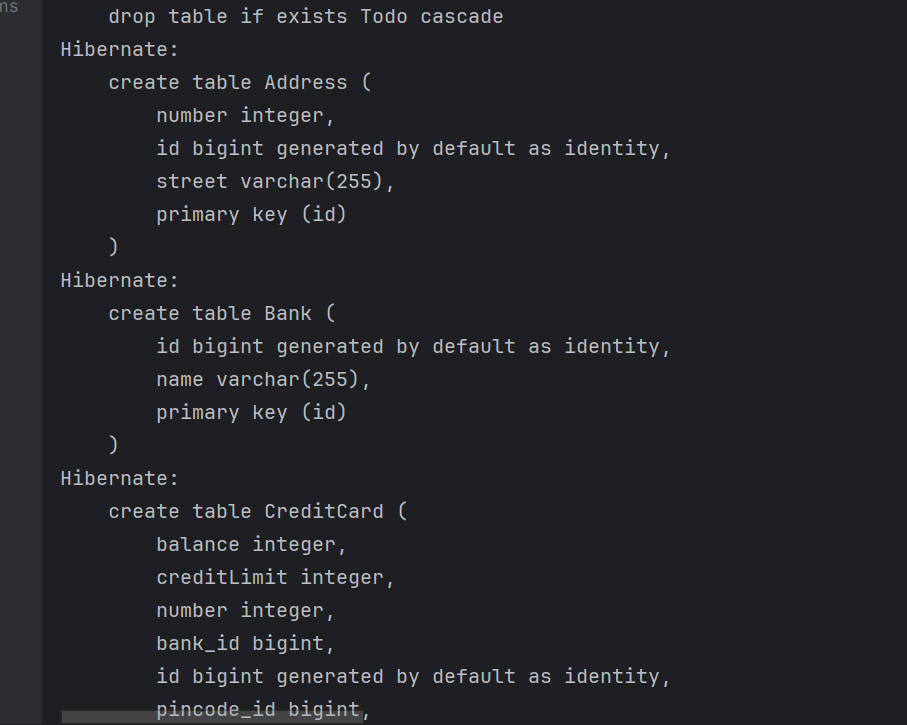
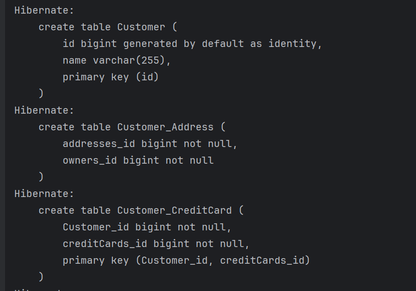
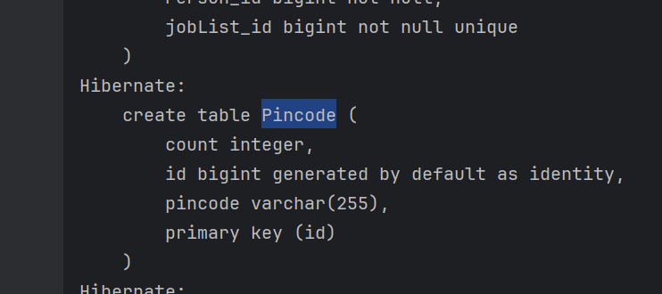

## Expass 4 Report

For this week we were supposed to learn how JPA works and implement an application that uses JPA to store information.

##### Initial Setup
The initial setup didn't take too long, and the tutorial that we were supposed to do helped a lot in understanding exactly how JPA works. Most of my time on this step was spent googling exactly how the persistence file works in JPA, something i will elaborate more in the **Challenges Faced** section.

##### Experiment 2
Experiment 2 went quite fast as well, thanks to the tutorial in the initial step and a few google searches. The skeleton code that we received had almost everything we needed to know, and was straightforward in knowing exactly what to do to run the code.

##### Challenges Faced / Unresolved Issues
The only issue i encountered throughout this whole process had to do with the tests. For some reason, when i ran the tests, the Entities were not being recognized giving us an `UnknownEntityException`, this was resolved when i had to specify each new class in persistence.xml letting me know that autodetection that was specified in the file was not working. After doing some research on google, i found out that apparently Hibernate ORM will only look for entities in the same JAR , so moving the entities to the test code would work, but since specifying the entities in persistence.xml worked fine, i decided to just continue with that.

Another problem with the tests that i encountered was in the tutorial, where apparently i was using JUnit 5, meaning that i had to change some of the imports and annotations like @Before and @Test, to get the code IntelliJ to actually understand the code.

##### Questions/ Database Inspection
- Explain the used database and how/when it runs
    - By inspecting the persistence.xml file we can see that the database being used is the H2 database which is an in-memory database. It automatically started when we run our JPA application or the tests.
-  Can you provide the SQL used to create the table **Customer**?
    - To get the SQL used to create the Customer table, we just needed to change the value of this property found in persistence.xml `<property name="hibernate.show_sql" value="false"/>` from `false` to `true`. This shows us all the SQL used to create the tables, and the one used to create **Customer** is :
   ```sql
   create table Customer (
       id bigint generated by default as identity,
       name varchar(255),
       primary key (id)
   )

    ```
- Find a way to inspect the database tables being created and create a database schema in your report. Do the created tables correspond to your initial thoughts regarding the exercise?
	- To inspect the database tables is just to do the step above, which will show us the tables created. The number of tables was exactly what i expected: 5 tables for each class, and 2 join tables for the many to `@ManyToMany` relationship between the Customer class and Address( Customer_Address), and between the Customer class and CreditCard (Customer_CreditCard).
##### Schema

| Table Name          | Columns                                                 |
| ------------------- |---------------------------------------------------------|
| Address             | id(PK), number, street                                  |
| Bank                | id(PK), name                                            |
| CreditCard          | id(PK), balance, creditLimit, number,bank_id, pincode_id |
| Customer            | id(PK), name                                            |
| Customer_Address    | addresses_id,owners_id                                  |
| Customer_CreditCard | Customer_id (PK), creditCards_id (PK)                   |
| Pincode             | id(PK), coutn, pincode                                  |
##### Screenshots






##### Link to experiment 2
[Experiement 2]()
